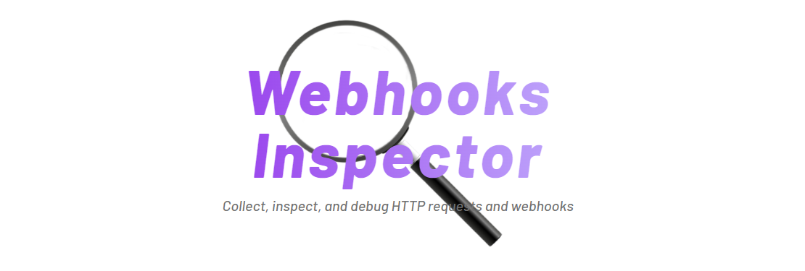
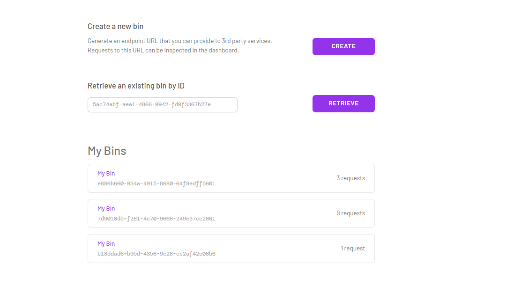

# Webhooks Inspector

`Webhooks Inspector` simplifies the collection and inspection of HTTP requests and webhooks. 

Webhooks are HTTP requests that an app sends to a client's HTTP endpoint when specific event(s) occur, providing a more efficient alternative to both short and long polling methods.

With `Webhooks Inspector`, you can create bins to store webhooks and inspect their details. It generates unique URLs for sharing with webhook providers.

Built with: Express, React, TypeScript, Tailwind, MongoDB, Postgres, Socket.io, Nginx, DigitalOcean Droplets.

`Webhooks Inspector` supports multiple bins to organize your webhooks.

Within each bin you can inspect and analyze the Header and Payload.

