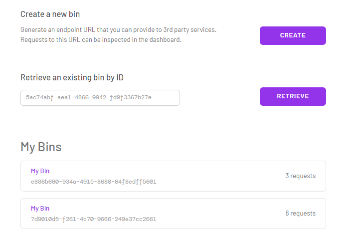
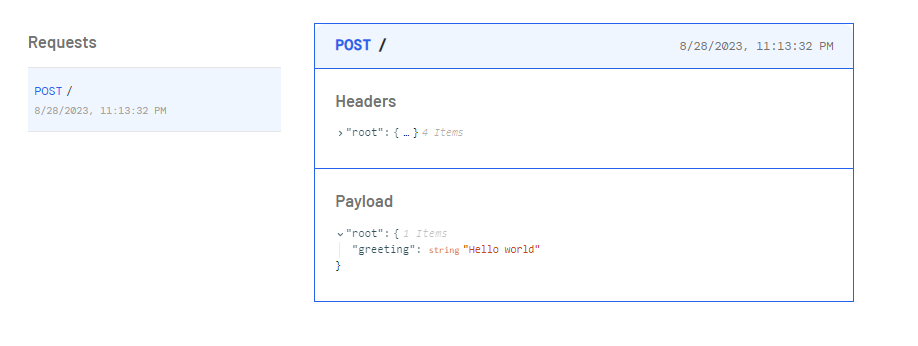

# Webhooks Inspector

`WebhooksInspector` simplifies the collection and inspection of HTTP requests and webhooks. Webhooks are HTTP requests sent by apps following events, offering efficiency compared to short or long polling. With `WebhooksInspector`, you can create bins to store webhooks and inspect their details. It generates unique URLs for sharing with webhook providers.

Built with: Express, React, TypeScript, Tailwind, MongoDB, Postgres, Socket.io, Nginx, DigitalOcean Droplets.

`WebhooksInspector` supports multiple bins to organize your webhooks.

Within each bin you can inspect and analyze the Header and Payload.
